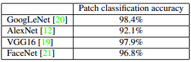
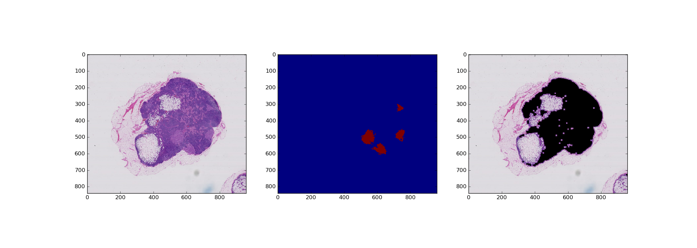
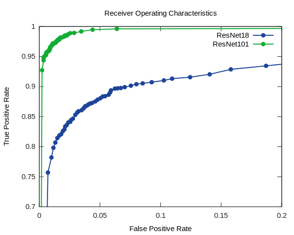
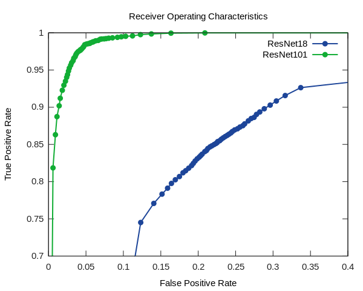

# Metastatic Breast Cancer Detection Using CNN
## Introduction
Breast cancer has been one of the deadliest and most frequent cancer type. Moreover, its diagnosis heavily relies on visual inspection of whole-slides by physicians. Aiming to reduce the manual labor, in this work, we implemented a deep learning frame work that preprocesses raw gigabyte-sized whole-slide images and automatically detects cancerous regions using ResNet. Then, we show the practical effectiveness of our framework by ROC plots. Finally, we compare the performances of two different CNN models on two datasets with different sizes. Below is a figure demonstrating the visual difference between normal and metastatic regions obtained from [1].

## Related Work
The same problem of metastatic breast cancer has been previously organized as CAMELYON 2016 Grand Challenge [1]. The entire dataset consists of 270 whole-slide images (WSIs) available for training. For each image, its binary mask of cancer region is also given. The best detection framework submitted to the challenge came from a joint team between MIT and Harvard. Patch accuracy of 98.4% using GoogLeNet has been reported in their paper, *Deep Learning for Identifying Metastatic Breast Cancer* [2]. Here is a table of the patch accuracy using different network models as reported in their paper.

In their approach, they first segment out the foreground region (region with cells) from the background in the whole slide images. Then, they randomly extract millions of small patches (256 x 256) from the segmented foreground to train the neural network. Notably, they further enhance their network by feeding more *hard negative* samples, where those samples are extracted from histologic mimics of cancer. Next, the patch-based accuracy is computed. Furthermore, the framework is also evaluated on two more metrics: slide-based classification and lesion-based detection.       

## Our Approach
In this section, the methods used in our attempt of automatic cancer detection are described. Moreover, the challenges we faced in our development are also discussed. Intuitively, the project can be broken down into two major stages: dataset generation and neural network training.
### Generating the Dataset 
In this subsection, the issues and methods in generating the training dataset are described. 

The 270 RGB WSIs and their corresponding binary masks are given in ``.tif`` format. Normally, each WSI is of size 1-3GB when compressed with 130k x 80k pixels and each binary mask is around 50MB. Below is a figure of the tumor mask.

Note that the extremely large size of each WSI proposes significant constraints on our preprocessing, since loading a fully uncompressed WSI into RAM is practically impossible. For the smallest WSI (521MB) we have, it is observed that loading it into RAM takes more than 90% available space and makes the operating system significantly irresponsible. 

Another issue caused by the scale of the WSI is disk usage. Assume the average size of WSI is 1.5GB, even 10 WSIs alone can easily take up ``10 * 1.5GB = 15GB`` disk space, not to mention the disk space taken by the generated dataset. As a result, downloading everything we need at once to disk is impractical given the hardware we have.

In order to address all the aforementioned issues, we developed the following pipeline:

1. Since the entire set of WSI is given to us via Google Drive, Google Drive API (``googledrive.py``) is used in our preprocessing script (``preprocess.py``) to download WSI individually and erase the raw WSI after its patches have been extracted if necessary in order to save disk space. 

2. Given the large size of each WSI, using Geospatial Data Abstraction Library (GDAL) gives us the freedom to read image ROI without loading the entire WSI into memory. GDAL also provides easy interface to extract different levels of overview of WSIs, which becomes very useful in the foreground segmentation process described in the next step.

3. For each WSI, we use an overview (roughly 3k x 3k pixels) of the original WSI to calculate the foreground mask. Similar to the approach in [2], Otsu's algorithm is used after converting the overview to HSV colorspace. Note that due to the dramatic difference in size between original WSI and its foreground mask, looking up the foreground mask by quantizing coordinates in WSI introduces noticeable quantization error. The consequence of this error is especially visible on the boundaries of the foreground regions, where backgrounds are mistakenly treated like foreground. 

4. As a result, we take advantage of standard morphological operations on the foreground mask. More specifically, we erode the mask first with a 15 by 15 kernel followed by 7 by 7 dilation to suppress noise in the mask as well as shrink the foreground region. Consequently, more boundary regions are discarded and number of background images in the dataset is reduced. Below is a figure demonstrating foreground mask.

5. Finally, for each WSI, we iterate the whole image in raster order to extract foreground patches while looking up in the tumor mask image for its ground-truth label. Patches are discarded randomly in order to make the final dataset size reasonable.

### Training and Evaluating the Neural Network
In this subsection, methods and issues relevant to the training and evaluation of our neural network based classifier (``train.lua``) are described.

25% of the generated patches are used in testing while the rest are used for training. Before feeding the network, the patches are normalized to be zero-mean and unit-variance.

The network model of choice in our framework is ResNet [3]. Since we want the final output of the network to be the probability of the input patch containing cancer cells, a *Softmax* layer is appended in the end and *Negative Log Likelihood* is used as the loss function.

The biggest issue we ran into while training the network is concerned with local minima. When we train a randomly initiated network on our generated dataset, the network tends to classify every patch into only one category, either tumor or normal. Several epochs later, the network is still stuck with its monotonous behavior. We first eliminated the possibility of overfitting, since the accuracy of classifying everything into one single category is only about 60%. Then, it is observed that there is a significant loss reduction between making random predictions and making monotonous predictions. As a result, we hypothesize the network is stuck in a very steep local minima.

In order to resolve the local minima issue, transfer learning is used. Instead of giving the network totally random weights initially. We use ImageNet pre-trained ResNet model obtained from [4] to keep the initial location of the network on the error surface away from the local minima. In the mean time, transfer learning also speeds up the convergence since the pre-trained network is already an expert in feature extraction. To implement transfer learning, we simply strip away the last 1000-node classification layer and replace it with our own *Softmax* layer.  

## Results and Discussion
In this section, the effectiveness of our framework is demonstrated using two models and two datasets. Note that all the experiments are carried out on Intel i7-4790k processor with 16GB RAM and Nvidia GeForce 980 Ti GPU with 2GB RAM.

First, on the smaller dataset, where 18k patches (10k normal and 8k tumor) are used for training and 5k patches are used for testing, the Receiver Operating Characteristics (ROC) curve is shown below.

Then, on the full dataset, where 35k patches (18k normal and 17k tumor) are used for training and 12k patches are used for testing, the ROC is shown below.

The overall best accuracy is reported in the table below.

|           | Small dataset | Full dataset |
|:---------:|:-------------:|:------------:|
|  ResNet18 |     92.42%    |    82.41%    |
| ResNet101 |     98.22%    |    96.73%    |

It can be observed that the deeper network (ResNet101) significantly outperforms ResNet18 on both datasets. On the full dataset, the model of ResNet18 is too simple to keep itself on par with the variations in the dataset. On the other hand, ResNet101 achieved similar patch accuracy (96.73%) compared to the results reported in [2].

Overall, our framework has demonstrated its predictive ability at low false positive rate. Especially on the full dataset, ResNet101 has a FPR of 1% while the TPR is greater than 90%. 

## Conclusion
In this project, we developed a deep learning framework that preprocesses raw whole-slide images, carries out training on the generated patches and achieves high patch classification accuracy. Future work includes using a dataset that is much larger scale (utilizing all 270 training and 130 testing WSIs) and experimenting with other different neural network models. 

## References
[1] https://camelyon16.grand-challenge.org

[2] https://arxiv.org/pdf/1606.05718v1.pdf

[3] https://arxiv.org/pdf/1512.03385v1.pdf

[4] https://github.com/facebook/fb.resnet.torch/tree/master/pretrained
